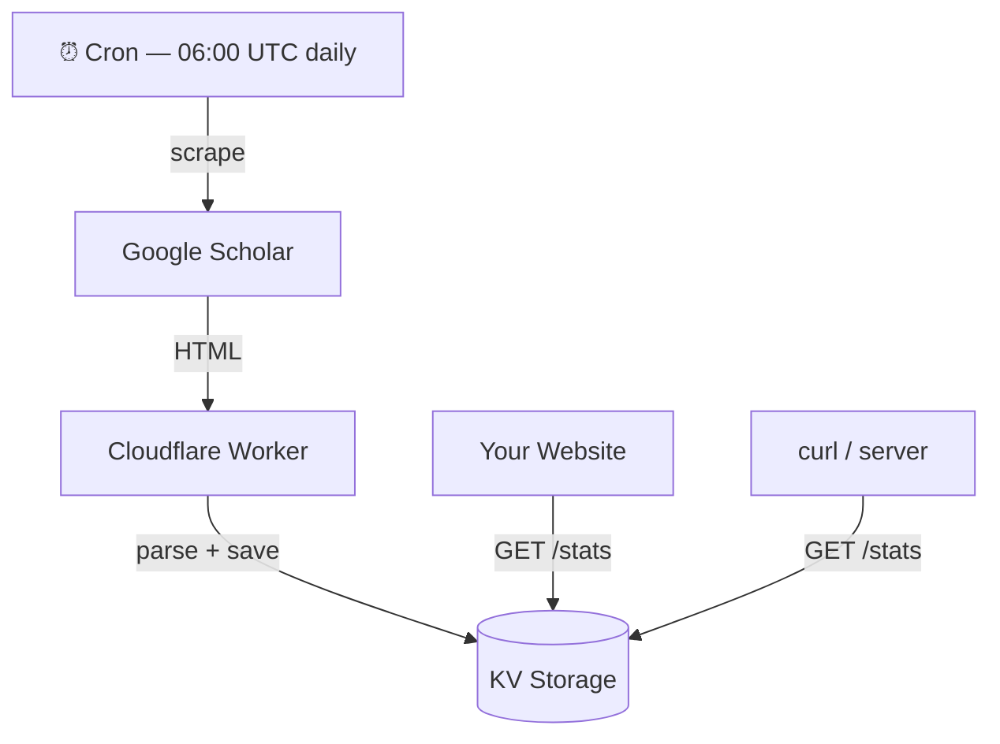
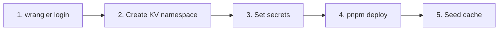
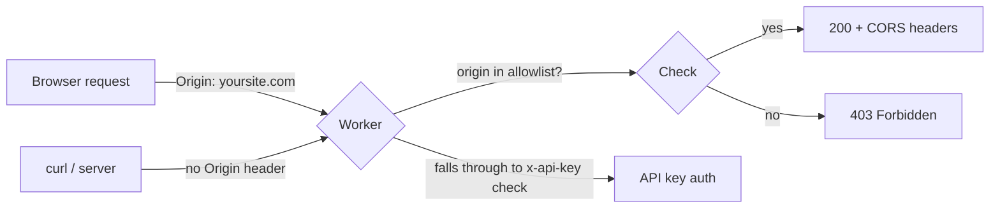

# Google Scholar Stats — Cloudflare Worker

Scrapes your Google Scholar profile once a day and serves the data via a simple JSON API. Runs entirely on Cloudflare's **free tier**.

---

## How it works



### Free tier usage

| Resource         | Limit         | This project |
| ---------------- | ------------- | ------------ |
| Worker requests  | 100,000 / day | ~1-10 / day  |
| KV reads         | 100,000 / day | ~1-10 / day  |
| KV writes        | 1,000 / day   | 1 / day      |
| Cron invocations | unlimited     | 1 / day      |

---

## Prerequisites

- Node.js >= 18
- A free [Cloudflare account](https://dash.cloudflare.com/sign-up)
- Your **public** Google Scholar profile URL

---

## Local Development

**1. Install dependencies**

```bash
pnpm install
```

**2. Create `.dev.vars`**

```
SCHOLAR_URL=https://scholar.google.com/citations?user=YOUR_ID&hl=en
API_KEY_HASH=your_hash_here
```

> Leave `API_KEY_HASH` empty to skip auth locally.

**3. Run**

```bash
pnpm dev
```

**4. Test**

```bash
curl http://localhost:8787/
curl http://localhost:8787/stats -H "x-api-key: YOUR_RAW_KEY"
curl -X POST http://localhost:8787/refresh -H "x-api-key: YOUR_RAW_KEY"
```

---

## Authentication

One key protects both `/stats` and `/refresh`. Only the **hash** is stored — never the raw key.

**Generate your key + hash / use your preferred tool to create them:**

```bash
node -e "
  const crypto = require('crypto');
  const key  = crypto.randomBytes(32).toString('hex');
  const hash = crypto.createHash('sha256').update(key).digest('hex');
  console.log('RAW KEY:', key);
  console.log('HASH:   ', hash);
"
```

## Deployment



**1. Login**

```bash
npx wrangler login
```

**2. Create KV namespace**

```bash
npx wrangler kv namespace create SCHOLAR_KV
```

Paste the printed `id` into `wrangler.toml`:

```toml
[[kv_namespaces]]
binding = "SCHOLAR_KV"
id      = "paste-id-here"
```

**3. Set secrets**

```bash
npx wrangler secret put SCHOLAR_URL
npx wrangler secret put API_KEY_HASH
npx wrangler secret put ALLOWED_ORIGINS   # e.g. https://yoursite.com
```

**4. Deploy**

```bash
pnpm deploy
```

**5. Seed the cache** (so data is available immediately without waiting for the cron)

```bash
curl -X POST https://scholar-stats.YOUR-SUBDOMAIN.workers.dev/refresh \
     -H "x-api-key: YOUR_RAW_KEY"
```

---

## API

All responses use this shape:

```json
{
  "status": "OK",
  "statusCode": 200,
  "message": "...",
  "data": { ... }
}
```

### Endpoints

| Method | Path       | Auth        | Description              |
| ------ | ---------- | ----------- | ------------------------ |
| GET    | `/`        | None        | Health check             |
| GET    | `/stats`   | `x-api-key` | Returns cached stats     |
| POST   | `/refresh` | `x-api-key` | Triggers a manual scrape |

### `GET /stats` — example response

```json
{
  "status": "OK",
  "statusCode": 200,
  "message": "Success",
  "data": {
    "name": "Jane Smith",
    "affiliation": "University of Example",
    "interests": ["Machine Learning", "Computer Vision", "NLP"],
    "citations": { "all": 520, "recent": 210 },
    "hIndex": { "all": 12, "recent": 8 },
    "i10Index": { "all": 18, "recent": 10 },
    "citationHistory": [
      { "year": 2022, "citations": 98 },
      { "year": 2023, "citations": 142 }
    ],
    "publications": [
      {
        "title": "A survey on deep learning methods for...",
        "authors": "J Smith, A Johnson, ...",
        "journal": "IEEE Trans. Neural Netw. 14 (2)",
        "citedBy": 210,
        "year": 2022,
        "link": "https://scholar.google.com/citations?..."
      }
    ],
    "scrapedAt": "2024-04-15T06:01:23.456Z"
  }
}
```

---

## CORS — calling from a browser

Set `ALLOWED_ORIGINS` to your site's domain. The browser automatically sends the `Origin` header — no extra code needed.



```js
// No extra headers needed in your frontend — browser sends Origin automatically
fetch("https://scholar-stats.YOUR-SUBDOMAIN.workers.dev/stats")
  .then((r) => r.json())
  .then(({ data }) => console.log(data.citations.all));
```

---

## Troubleshooting

| Symptom               | Cause                           | Fix                                 |
| --------------------- | ------------------------------- | ----------------------------------- |
| `/stats` returns 404  | Cache empty, cron not run yet   | Call `POST /refresh` manually       |
| 403 on any endpoint   | Sending hash instead of raw key | Send the **raw key** in `x-api-key` |
| 500 / Scholar blocked | Scholar rate-limiting the IP    | Wait 10-15 min and retry            |
| Stats are stale       | Cron failed silently            | Check logs: `pnpm tail`             |

---

## License

MIT
