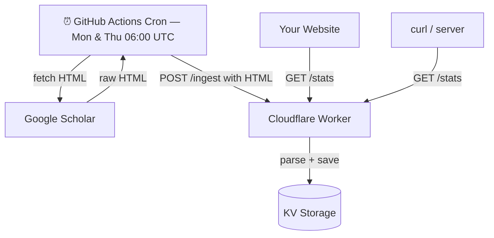
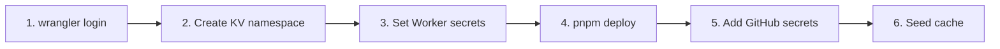
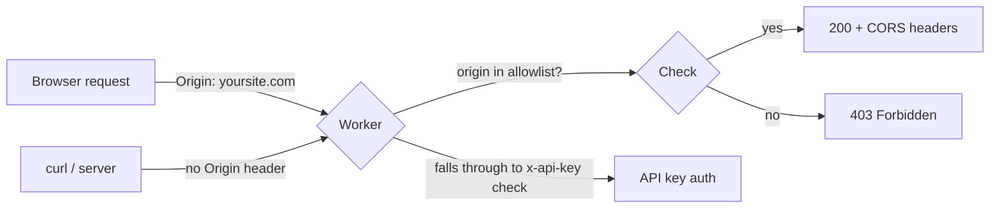

# Google Scholar Stats — Cloudflare Worker

Scrapes your Google Scholar profile on a schedule and serves the data via a simple JSON API. Runs entirely on Cloudflare's **free tier**.

---

## How it works


```mermaid
flowchart TD
    A[⏰ GitHub Actions Cron — Mon & Thu 06:00 UTC] -->|fetch HTML| B[Google Scholar]
    B -->|raw HTML| A
    A -->|POST /ingest with HTML| C[Cloudflare Worker]
    C -->|parse + save| D[(KV Storage)]
    E[Your Website] -->|GET /stats| C
    F[curl / server] -->|GET /stats| C
```

### Why GitHub Actions instead of a Worker cron?

Google Scholar blocks requests originating from **Cloudflare datacenter IPs** — even with browser-like headers and retries, the Worker would reliably get blocked or served a CAPTCHA page. Cloudflare's IP ranges are well-known to Google and are filtered aggressively.

GitHub Actions runners use **Azure-hosted IPs** that Google does not block at low request frequency. Moving the scrape there means the Worker never makes outbound requests to Google at all — it only receives, parses, and stores the HTML sent by the Action.

|                           | Worker cron            | GitHub Actions                      |
| ------------------------- | ---------------------- | ----------------------------------- |
| IP reputation with Google | ❌ Datacenter, blocked | ✅ Not targeted at low frequency    |
| Free tier                 | ✅                     | ✅                                  |
| Scrape reliability        | ❌ Unreliable          | ✅ Reliable                         |
| Infrastructure changes    | None                   | Adds `scripts/scrape.js` + workflow |

### Free tier usage

| Resource        | Limit         | This project          |
| --------------- | ------------- | --------------------- |
| Worker requests | 100,000 / day | ~1–10 / day           |
| KV reads        | 100,000 / day | ~1–10 / day           |
| KV writes       | 1,000 / day   | 2 / week              |
| GitHub Actions  | 2,000 min/mo  | ~2 min per run × 8/mo |

---

## Prerequisites

- Node.js >= 18
- A free [Cloudflare account](https://dash.cloudflare.com/sign-up)
- A GitHub account (for Actions)
- Your **public** Google Scholar profile URL

---

## Local Development

**1. Install dependencies**

```bash
pnpm install
```

**2. Create `.dev.vars`**

```
ALLOWED_ORIGINS=http://localhost:3000
```

> Leave `API_KEY_HASH` empty to skip auth locally.

**3. Run**

```bash
pnpm dev
```

**4. Test ingest locally** by running the scrape script against the local Worker:

```bash
SCHOLAR_URL="https://scholar.google.com/citations?user=YOUR_ID&hl=en" \
WORKER_URL="http://localhost:8787" \
API_KEY="" \
node scripts/scrape.js
```

---

## Authentication

One key protects both `/stats` and `/ingest`. Only the **hash** is stored — never the raw key.

**Generate your key + hash:**

```bash
node -e "
  const crypto = require('crypto');
  const key  = crypto.randomBytes(32).toString('hex');
  const hash = crypto.createHash('sha256').update(key).digest('hex');
  console.log('RAW KEY (use in GitHub secrets + curl):', key);
  console.log('HASH    (use in wrangler secret):', hash);
"
```

---

## Deployment


```mermaid
flowchart LR
    A[1. wrangler login] --> B[2. Create KV namespace]
    B --> C[3. Set Worker secrets]
    C --> D[4. pnpm deploy]
    D --> E[5. Add GitHub secrets]
    E --> F[6. Seed cache]
```

**1. Login**

```bash
npx wrangler login
```

**2. Create KV namespace**

```bash
npx wrangler kv namespace create SCHOLAR_KV
```

Paste the printed `id` into `wrangler.toml`:

```toml
[[kv_namespaces]]
binding = "SCHOLAR_KV"
id      = "paste-id-here"
```

**3. Set Worker secrets**

```bash
npx wrangler secret put API_KEY_HASH
npx wrangler secret put ALLOWED_ORIGINS   # e.g. https://yoursite.com
```

**4. Deploy**

```bash
pnpm deploy
```

**5. Add GitHub Actions secrets**

Go to your repo → **Settings → Secrets and variables → Actions** and add:

| Secret        | Value                                              |
| ------------- | -------------------------------------------------- |
| `SCHOLAR_URL` | Your full Scholar profile URL                      |
| `WORKER_URL`  | `https://scholar-stats.YOUR-SUBDOMAIN.workers.dev` |
| `API_KEY`     | The **raw** key (not the hash)                     |

**6. Seed the cache** (first run — trigger manually so you don't wait for the next scheduled run)

Go to **Actions → Scholar Scrape → Run workflow**, or run locally:

```bash
SCHOLAR_URL="https://scholar.google.com/citations?user=YOUR_ID&hl=en" \
WORKER_URL="https://scholar-stats.YOUR-SUBDOMAIN.workers.dev" \
API_KEY="your_raw_key" \
node scripts/scrape.js
```

**7. Verify**

```bash
curl https://scholar-stats.YOUR-SUBDOMAIN.workers.dev/stats \
  -H "x-api-key: YOUR_RAW_KEY"
```

---

## API

All responses use this shape:

```json
{
  "status": "OK",
  "statusCode": 200,
  "message": "...",
  "data": { ... }
}
```

### Endpoints

| Method | Path      | Auth                            | Description                          |
| ------ | --------- | ------------------------------- | ------------------------------------ |
| GET    | `/`       | None                            | Health check                         |
| GET    | `/stats`  | `x-api-key` or Origin allowlist | Returns cached stats                 |
| POST   | `/ingest` | `x-api-key`                     | Accepts raw HTML from GitHub Actions |

### `GET /stats` — example response

```json
{
  "status": "OK",
  "statusCode": 200,
  "message": "Success",
  "data": {
    "name": "Jane Smith",
    "affiliation": "University of Example",
    "interests": ["Machine Learning", "Computer Vision", "NLP"],
    "citations": { "all": 520, "recent": 210 },
    "hIndex": { "all": 12, "recent": 8 },
    "i10Index": { "all": 18, "recent": 10 },
    "citationHistory": [
      { "year": 2022, "citations": 98 },
      { "year": 2023, "citations": 142 }
    ],
    "publications": [
      {
        "title": "A survey on deep learning methods for...",
        "authors": "J Smith, A Johnson, ...",
        "journal": "IEEE Trans. Neural Netw. 14 (2)",
        "citedBy": 210,
        "year": 2022,
        "link": "https://scholar.google.com/citations?..."
      }
    ],
    "scrapedAt": "2024-04-15T06:01:23.456Z"
  }
}
```

---

## CORS — calling from a browser

Set `ALLOWED_ORIGINS` to your site's domain. The browser automatically sends the `Origin` header — no extra code needed.


```mermaid
flowchart LR
    A[Browser request] -->|Origin: yoursite.com| B{Worker}
    B -->|origin in allowlist?| C{Check}
    C -->|yes| D[200 + CORS headers]
    C -->|no| E[403 Forbidden]
    F[curl / server] -->|no Origin header| B
    B -->|falls through to x-api-key check| G[API key auth]
```

```js
// No extra headers needed in your frontend — browser sends Origin automatically
fetch("https://scholar-stats.YOUR-SUBDOMAIN.workers.dev/stats")
  .then((r) => r.json())
  .then(({ data }) => console.log(data.citations.all));
```

---

## Troubleshooting

| Symptom                         | Cause                                     | Fix                                         |
| ------------------------------- | ----------------------------------------- | ------------------------------------------- |
| `/stats` returns 404            | Cache empty, Actions not run yet          | Trigger workflow manually from GitHub UI    |
| Actions step fails with CAPTCHA | Scholar temporarily rate-limiting Actions | Re-run the workflow after a few minutes     |
| 403 on `/ingest`                | Wrong API key in GitHub secret            | Re-check `API_KEY` secret matches raw key   |
| 403 on `/stats` from browser    | Origin not in allowlist                   | Add your domain to `ALLOWED_ORIGINS` secret |
| Stats are stale                 | Workflow failed silently                  | Check Actions tab in GitHub for failed runs |

---

## License

MIT
