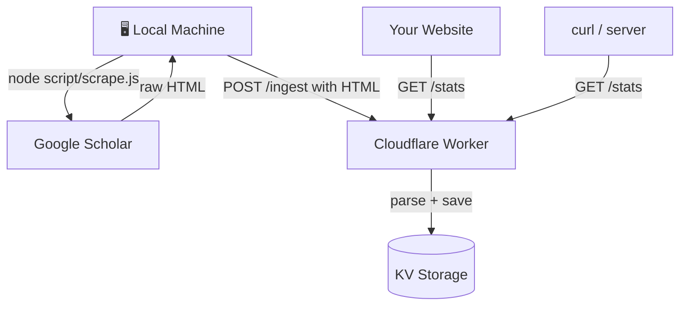
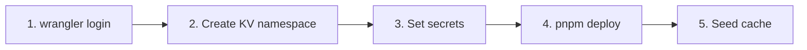
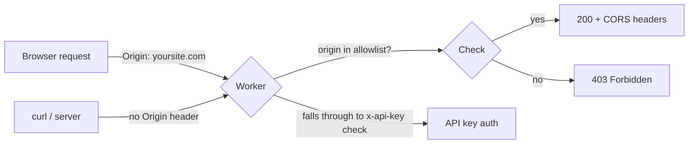

# Google Scholar Stats — Cloudflare Worker

Scrapes your Google Scholar profile and serves the data via a simple JSON API. Runs entirely on Cloudflare's **free tier**.

---

## How it works


```mermaid
flowchart TD
    A[🖥️ Local Machine] -->|node script/scrape.js| B[Google Scholar]
    B -->|raw HTML| A
    A -->|POST /ingest with HTML| C[Cloudflare Worker]
    C -->|parse + save| D[(KV Storage)]
    E[Your Website] -->|GET /stats| C
    F[curl / server] -->|GET /stats| C
```

### Why scrape locally instead of from the Worker?

Google Scholar blocks requests from **Cloudflare datacenter IPs** — even with browser-like headers and retries, the Worker gets blocked or served a CAPTCHA. GitHub Actions runners (Azure IPs) also get blocked intermittently.

The most reliable approach is running the scrape script from your **local machine** and pushing the parsed data to the Worker's `/ingest` endpoint. Since Scholar data only changes every few days, running it manually or on a local cron is perfectly fine.

|                           | Worker cron            | Local script                |
| ------------------------- | ---------------------- | --------------------------- |
| IP reputation with Google | ❌ Datacenter, blocked | ✅ Residential, not blocked |
| Free tier                 | ✅                     | ✅                          |
| Scrape reliability        | ❌ Unreliable          | ✅ Reliable                 |
| Requires manual run       | No                     | Yes (or local cron)         |

> **Looking for the old fully-automated version?** The original Worker cron approach (where the Worker fetches Scholar directly) is preserved in `src/old-index.js`. To use it, change `main = "src/old-index.js"` in `wrangler.toml` and uncomment the cron trigger. Note it is unreliable due to Cloudflare IPs being blocked by Google Scholar.

### Free tier usage

| Resource        | Limit         | This project |
| --------------- | ------------- | ------------ |
| Worker requests | 100,000 / day | ~1–10 / day  |
| KV reads        | 100,000 / day | ~1–10 / day  |
| KV writes       | 1,000 / day   | ~2 / week    |

---

## Project structure

```
├── index.js               # Cloudflare Worker — /ingest + /stats endpoints
├── script/
│   └── scrape.js          # Local scrape script — fetches Scholar HTML, POSTs to Worker
├── src/
│   └── old-index.js       # Original version — Worker cron + direct scraping
│                          # Kept for reference. Not used — Cloudflare IPs are blocked by Google.
├── wrangler.toml
└── package.json
```

---

## Prerequisites

- Node.js >= 18
- A free [Cloudflare account](https://dash.cloudflare.com/sign-up)
- Your **public** Google Scholar profile URL

---

## Local Development

**1. Install dependencies**

```bash
pnpm install
npm install node-fetch
```

**2. Create `.dev.vars`** for the Worker:

```
ALLOWED_ORIGINS=http://localhost:3000
```

> Leave `API_KEY_HASH` empty to skip auth locally.

**3. Run the Worker locally**

```bash
pnpm dev
```

**4. Create `.env`** for the scrape script:

```
SCHOLAR_URL=https://scholar.google.com/citations?user=YOUR_ID&hl=en
WORKER_URL=http://localhost:8787
API_KEY=
```

**5. Test ingest locally**

```bash
node --env-file=.env script/scrape.js
```

---

## Authentication

One key protects both `/stats` and `/ingest`. Only the **hash** is stored in the Worker — never the raw key.

**Generate your key + hash:**

```bash
node -e "
  const crypto = require('crypto');
  const key  = crypto.randomBytes(32).toString('hex');
  const hash = crypto.createHash('sha256').update(key).digest('hex');
  console.log('RAW KEY (use in .env + curl):', key);
  console.log('HASH    (use in wrangler secret):', hash);
"
```

---

## Deployment


```mermaid
flowchart LR
    A[1. wrangler login] --> B[2. Create KV namespace]
    B --> C[3. Set secrets]
    C --> D[4. pnpm deploy]
    D --> E[5. Seed cache]
```

**1. Login**

```bash
npx wrangler login
```

**2. Create KV namespace**

```bash
npx wrangler kv namespace create SCHOLAR_KV
```

Paste the printed `id` into `wrangler.toml`:

```toml
[[kv_namespaces]]
binding = "SCHOLAR_KV"
id      = "paste-id-here"
```

**3. Set Worker secrets**

```bash
npx wrangler secret put API_KEY_HASH
npx wrangler secret put ALLOWED_ORIGINS   # e.g. https://yoursite.com
```

**4. Deploy**

```bash
pnpm deploy
```

**5. Seed the cache**

Create a `.env` file pointing at the deployed Worker:

```
SCHOLAR_URL=https://scholar.google.com/citations?user=YOUR_ID&hl=en
WORKER_URL=https://scholar-stats.YOUR-SUBDOMAIN.workers.dev
API_KEY=your_raw_key
```

Then run the scrape script:

```bash
node --env-file=.env script/scrape.js
```

**6. Verify**

```bash
curl https://scholar-stats.YOUR-SUBDOMAIN.workers.dev/stats \
  -H "x-api-key: YOUR_RAW_KEY"
```

---

## Refreshing data

Whenever you want to update the cached stats, just run the scrape script again from your local machine:

```bash
node --env-file=.env script/scrape.js
```

Or set up a local cron (Mac/Linux) to automate it:

```bash
# crontab -e
0 6 * * 1,4  cd /path/to/project && node --env-file=.env script/scrape.js
```

---

## API

All responses use this shape:

```json
{
  "status": "OK",
  "statusCode": 200,
  "message": "...",
  "data": { ... }
}
```

### Endpoints

| Method | Path      | Auth                            | Description                         |
| ------ | --------- | ------------------------------- | ----------------------------------- |
| GET    | `/`       | None                            | Health check                        |
| GET    | `/stats`  | `x-api-key` or Origin allowlist | Returns cached stats                |
| POST   | `/ingest` | `x-api-key`                     | Accepts raw HTML from scrape script |

### `GET /stats` — example response

```json
{
  "status": "OK",
  "statusCode": 200,
  "message": "Success",
  "data": {
    "name": "Jane Smith",
    "affiliation": "University of Example",
    "interests": ["Machine Learning", "Computer Vision", "NLP"],
    "citations": { "all": 520, "recent": 210 },
    "hIndex": { "all": 12, "recent": 8 },
    "i10Index": { "all": 18, "recent": 10 },
    "citationHistory": [
      { "year": 2022, "citations": 98 },
      { "year": 2023, "citations": 142 }
    ],
    "publications": [
      {
        "title": "A survey on deep learning methods for...",
        "authors": "J Smith, A Johnson, ...",
        "journal": "IEEE Trans. Neural Netw. 14 (2)",
        "citedBy": 210,
        "year": 2022,
        "link": "https://scholar.google.com/citations?..."
      }
    ],
    "scrapedAt": "2024-04-15T06:01:23.456Z"
  }
}
```

---

## CORS — calling from a browser

Set `ALLOWED_ORIGINS` to your site's domain. The browser automatically sends the `Origin` header — no extra code needed.


```mermaid
flowchart LR
    A[Browser request] -->|Origin: yoursite.com| B{Worker}
    B -->|origin in allowlist?| C{Check}
    C -->|yes| D[200 + CORS headers]
    C -->|no| E[403 Forbidden]
    F[curl / server] -->|no Origin header| B
    B -->|falls through to x-api-key check| G[API key auth]
```

```js
// No extra headers needed in your frontend — browser sends Origin automatically
fetch("https://scholar-stats.YOUR-SUBDOMAIN.workers.dev/stats")
  .then((r) => r.json())
  .then(({ data }) => console.log(data.citations.all));
```

---

## Troubleshooting

| Symptom                      | Cause                             | Fix                                         |
| ---------------------------- | --------------------------------- | ------------------------------------------- |
| `/stats` returns 404         | Cache empty, scrape not run yet   | Run `node --env-file=.env script/scrape.js` |
| 403 from Scholar             | Scholar temporarily blocking IP   | Wait 15–30 min and retry                    |
| 403 on `/ingest`             | Wrong API key in `.env`           | Check `API_KEY` matches your raw key        |
| 403 on `/stats` from browser | Origin not in allowlist           | Add your domain to `ALLOWED_ORIGINS` secret |
| Stats are stale              | Haven't run the scrape script yet | Run the scrape script manually              |

---

## License

MIT
